Academics
++++++++++

Academics
==========

Ademics Module contains several sub modules. These sub modules might increase as the needs grow. 
The current sub modules are **registration**, **modules (courses)**, **supervision**, **postponement(module)**, **results** and **(examination) appeals**.

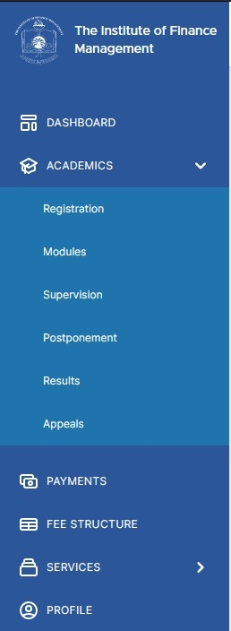

Registration
=============
Registration section gives the registration status of a given semester in an academic year. 

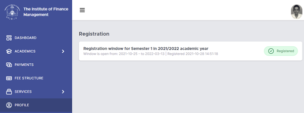

This section also allows a student to register for a specific semester when the registration window is open. 

Modules
========
Programs are comprised of modules or courses. The modules section provides a window for students to view their associated modules. 

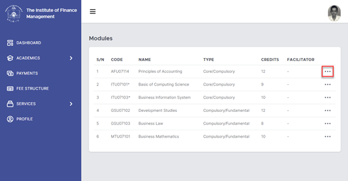

The three dot ellipses allow student to click and view the module contents. 

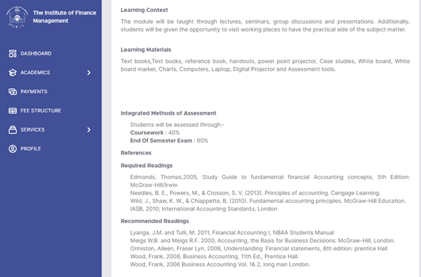

Supervision
============
Supervision section shows all the supervisors you have been assigned to. It can be Final Year Project, Field Report supervision or Research supervision. 

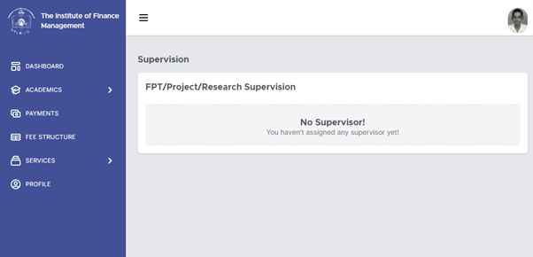

Postponement
=============

Studying duration ranges between a year up to three (or sometimes more) years. There are times student wish to postpone for whatever reason. 
The EMS system allows students to postpone a semester or an examination if there is (are) concrete reason(s) to do so. Postponement sections allow a student to postpone. Evidence for requesting postponement based on type of postponement component (semester/ final exam) is required. 

.. warning:: 
    This is action has profound consequences. 
    Make sure no one else can use your account. 
    Make sure only you can request for a postponement. 

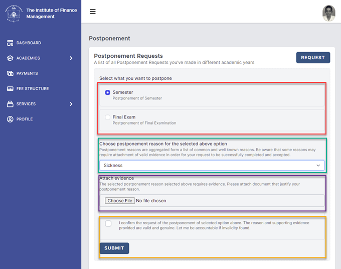
        
After requesting a postponement, the process will proceed, and you will be notified of the decision. 

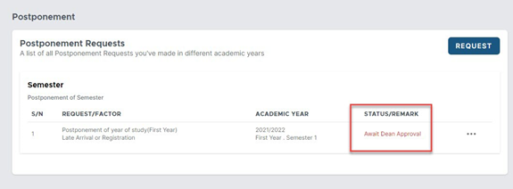

Results
=======

Results section gives the results of each module you are enrolled on. The first page will list all the module, and the ellipses will provide a way to view individual assessment. 

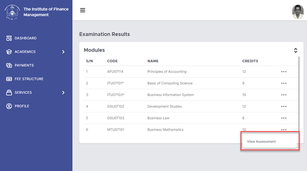

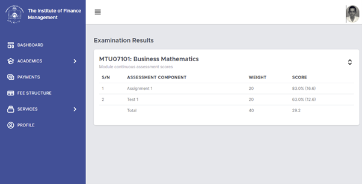

Appeals
=======

Appeal window is opened after examination results are out. The aim is to allow students to appeal for results which they believe are not correct. Appeal processes give room for appeal cases to be reviewed by a higher authority. 

In EMS system, appeal, from the student point of view involves the following steps. 

i.	Generate bill for number of modules (subject) one wish to appeal for (this is done in Payment section)
ii.	Confirm bill generation (this is done in Payment section)
iii.	Confirm appeal window is open (this is done in Academic>Appeal section)
iv.	Select the module(s) one wish to appeal for (this is done in Academic>Appeal section)
v.	Confirm appeal submission (this is done in Academic>Appeal section)

 

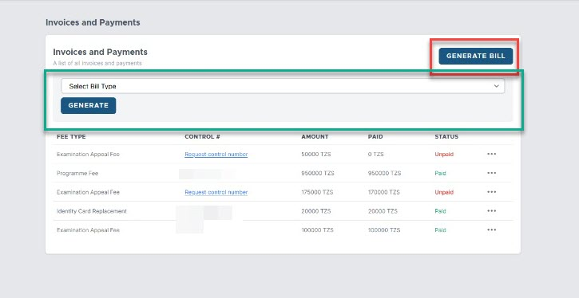

Generate bill for number of modules (subject) one wish to appeal for (this is done in Payment section)

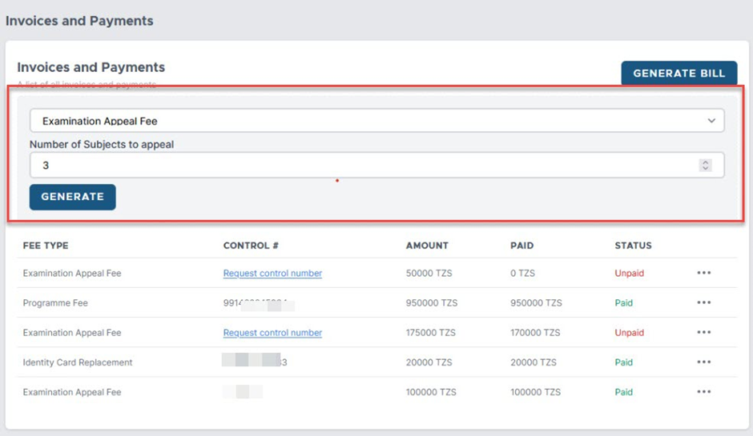

Confirm bill generation (this is done in Payment section)

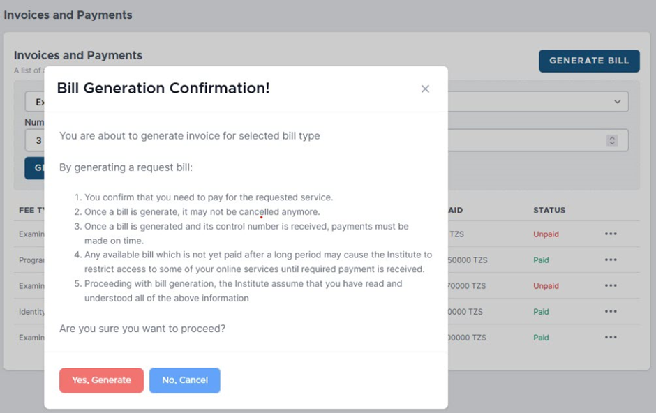

Confirm appeal window is open (this is done in Academic>Appeal section)
Click appeal

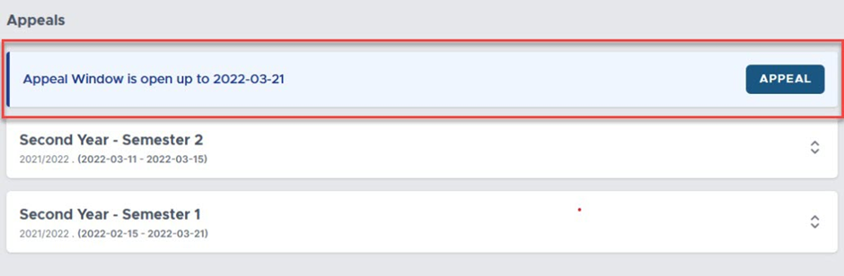

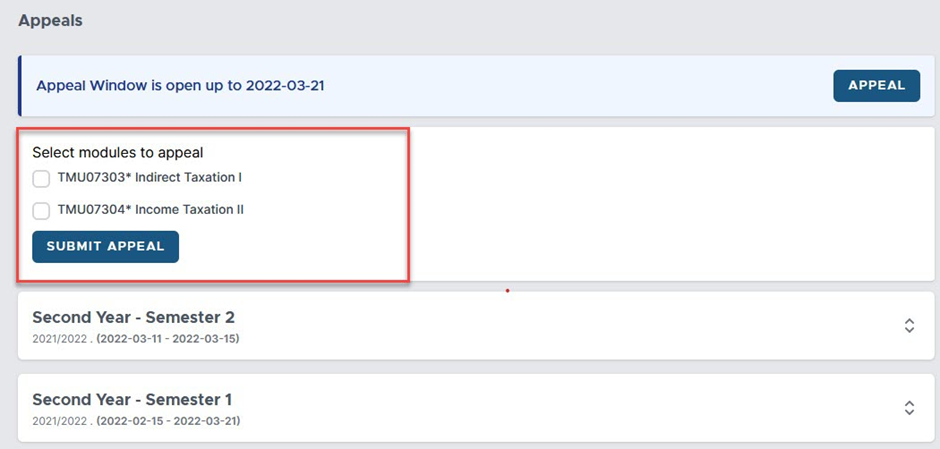

Select the module(s) one wish to appeal for (this is done in Academic>Appeal section)
Make sure the number of module(s) selected match the bill generated. 
Confirm appeal submission (this is done in Academic>Appeal section)

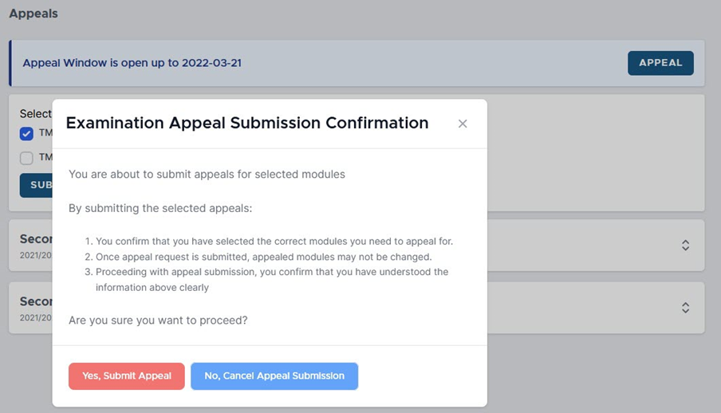

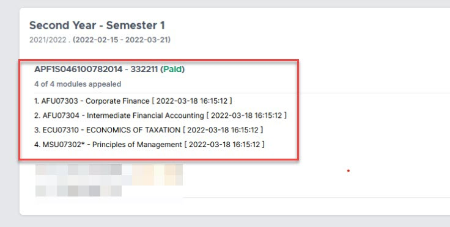

Congratulations! The appeal process has started.  

Once the appeal is done, notification will be generated, and you will be informed.

