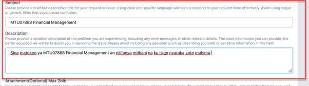

Help Desk
++++++++++

A help desk (eHelp) allows a student to seek assistance without the need of physically going to the ‘help’ office, for example head of department. 

.. image:: ../images/helpdesk.png

.. image:: ../images/newticket.png

To start using, create a new ticket by clicking the ‘Open New Ticket’ button. 

.. image:: ../images/ticketsection.png

Once that button is clicked, a window opens with Problem Category (select from drop down), Subject, Description and Attachment area appears. 
Problems and related issues are predefined to allow the problem to be sent to the appropriate handlers, example, academic problem related to examination will be directed to the specific head of academic department.

.. image:: ../images/academicexamination.png

If Academic is selected, issues related to academics are preloaded for one to select. Examination, Module Option or Postponement are part of academic related issues. 
Once a related issue has been selected, then you have to write the subject and its description. 

.. note:: 
    It is important to be as concise as possible to allow the problem handler to solve the problem easily.

When everything is selected and written, then you create a ticket. Success feedback indicates the ticket has been created. 

Once successful created, the ticket will be displayed as new and it includes ticket number, ticket subject, related issue and date opened. When the ticket is opened by ticket handler, the new status will change to open. 

.. image:: ../images/ticket.png

The help desk system allows for communication between the ticket handler and you. This is a very important aspect if you wish to provide further information. When the ticket is handled to completion, the ticket handler will close the ticket. 

.. image:: ../images/communication.png
