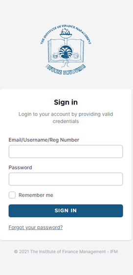
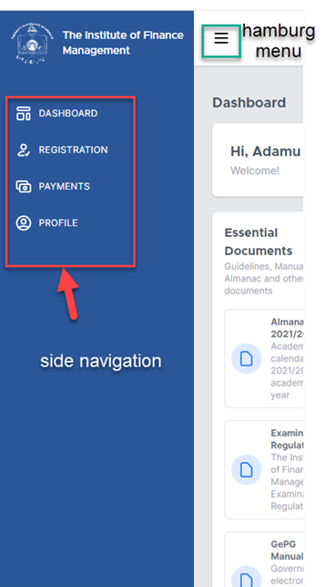
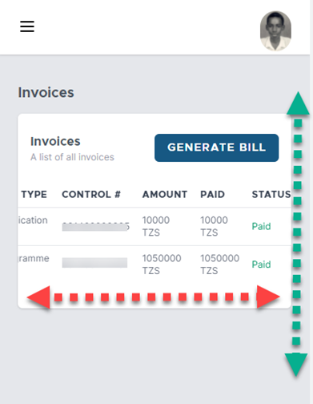
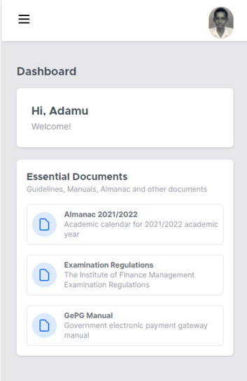
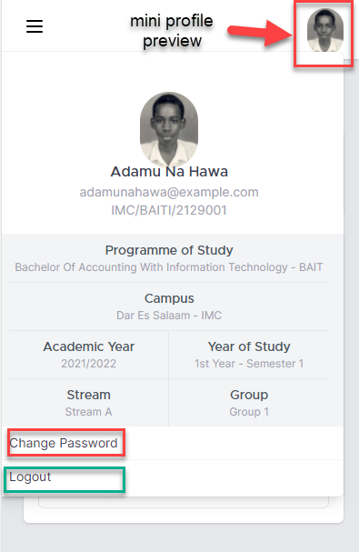
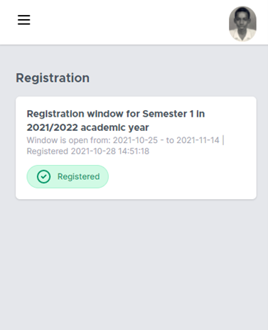
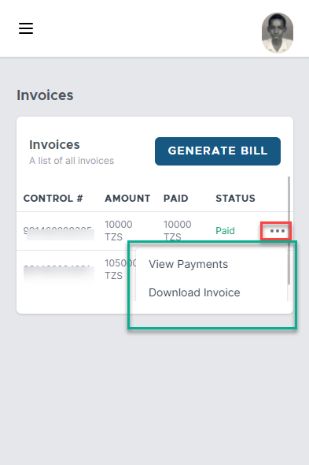

Mobile
++++++++++
EMS system is designed and developed to be responsive in all types of display sizes so at to ensure the user experience remains excellent across all devices. 

Sign In
========
To sign In, open any browser (Mozilla, Edge, Chrome, Safari etc.), open the IFM website, go to ICT Services, and open EMS. 
The sign in page will open. 
If you are using the system for the first time, put your Registration Number as Username and Registration Number as password. 

Navigating Around (Basics)
==========================

In small screen devices, especially smart phones, hamburg menu is a very important menu. Use this to open or close side navigation as shown in figure. 
Scrolling horizontally and vertically to see some content is a common in mobile devices. The system automatically will show scrolling bars both horizontally and vertically if they are required 

Dashboard
=========
Dashboard is the main window which opens after successful sign in. It welcomes you by name and it contain essential documents.  The current Almanac, and Examination Regulations are among the documents found in the Dashboard. 

Mini Profile Preview
====================

Mini Profile Preview provides a preview of your (student) profile. It is accessed by clicking the mini photo on the top right corner. Once that is done, the mini window will open and provide profile information like name, email address, registration number, programme of study etc. 
**Logout** button is found on this window. When you have finished using the system, use this button to safely logout of the system. 
     
.. caution:: 
    It is important to remember to logout to avoid other users using your account. 

**Update basic info** button is used to update basic information and update the password. Figure shows the information that can be update. 

.. warning:: 
    Immediately after signing in for first time, use this feature to update your password. 
    Make sure you remember your new password. It is important to do this to avoid other users using your account. 

Registration
=============

Registration section gives the registration status of a given semester in an academic year. 

Payments
=========

Payment’s section allows you to do four (4) things. 
View your **Invoices**, their control number, amount, and payment statuses, view individual **Payment** and their transaction number, reference number amount and date paid, and get **Receipt** of that payment. Also, one can generate bill for a particular payment, example lost ID, hostel fees etc. 

Profile
========

Profile page provides all the information about student as shown 

Academic Timeline provides the history of your academic information at IFM. Previous academics records are shown here.
Next of Kin Details provide information about next of kin. 
Note: Make sure this information is always correct.
Past education section provides details of your past academic records. The arrows can be expanded to provide more information. 
Documents section list the documents you have provided during registration. 

