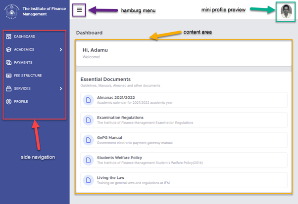

Navigation
+++++++++++

After Signing in, one will be welcomed by a dashboard. 

The system window is divided into three parts. The side navigation on the left, the top bar, which contains hamburg menu and mini profile preview photo and content area. 
Side Navigation contains menu of items related to a student. Dashboard, Registration, Payments, and Profile are menu items. Click any of this item and the contents of that item will be displayed on the content area. Example, when you click Payments, information related to payment will be displayed on the content area. 
Hamburg menu is used to open and close side navigation when a device with small display is used, example mobile phone. 
Mini profile preview photo is a link (clickable) that opens a mini profile preview. It is explained in the coming sections.
