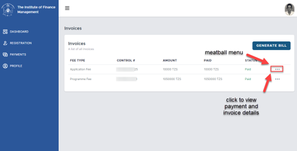
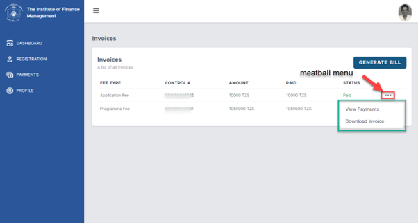
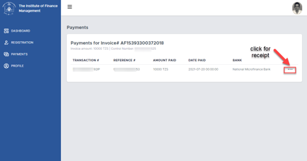
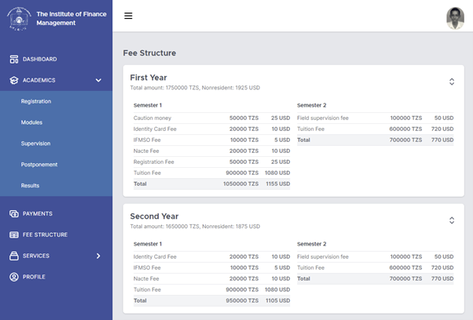

Payments
+++++++++

Payment
========
Payment’s section allows you to do four (4) things. 
View your Invoices, their control number, amount, and payment statuses. View individual payment and their transaction number, reference number amount and date paid, and get Receipt of that payment. Also, one can generate bill for a particular payment, example lost ID, hostel fees etc. 

Meatball menu allows one to click to reveal more menu items. In this case, when a meatball menu in the Invoices section is clicked, it reveals ‘View Payments’ and ‘Download Invoice’.  
Download Invoice menu download a given invoice, and you can keep it safe in your computer or for reference and View Payments opens a Payments page as shown.  In this section, you can download a receipt for a given payment. 

Fee Structure
=============

Fee Structure section provide a holistic view of all fees required to be paid by the student. The fees contain fee components, example caution money, identity card free, IFMSO fee etc. and they are for each given year of study. 
Fee structure provide a transparent way to view the breakdown of individual fee. 

