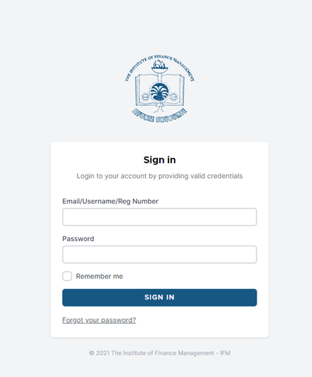

Sign In
++++++++
.. note:: 
    We suggest you read the entire manual at least once. 
    This document is updated regularly, remember to check for latest version.

    
To sign In, open any browser (Mozilla, Edge, Chrome, Safari etc.), open the IFM website, go to ICT Services, and open EMS. 
The sign in page will open. 

.. tip:: 
    If you are using the system for the first time, put your Registration Number as Username and Registration Number as password. 
